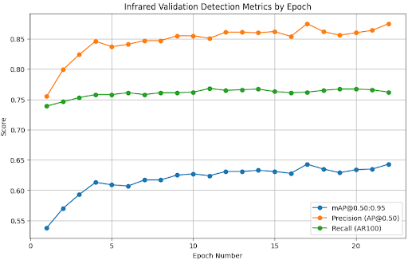
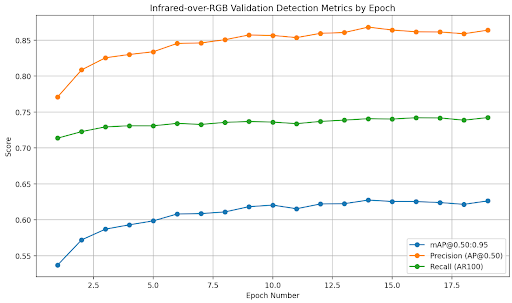
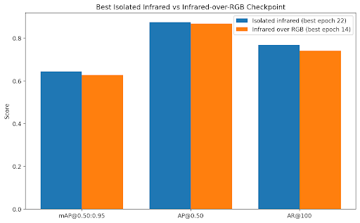

# Infrared Training Isolated

This model directory contains the RF-DETR Nano checkpoints produced from the `rfdetr_training_infrared_isolated.ipynb` notebook.

## Summary

This training run is the **infrared-only baseline** for the DroneVehicle portion of Phase 3. Unlike the infrared-over-RGB experiment, this notebook does **not** continue from a previously trained RGB checkpoint. Instead, it trains RF-DETR Nano starting from the base pretrained RF-DETR weights and learns only from the DroneVehicle infrared images.

The goal of this run is to answer a simple but important question:

**How well can the model perform on infrared aerial imagery when it is trained as a clean modality-specific detector from scratch, without inheriting RGB-learned features from earlier checkpoints?**

This makes the run an important reference point for comparing:

- infrared-only training from scratch
- continuation training from the enhanced RGB checkpoint
- future infrared experiments such as resolution changes, dataset cleanup, or class-remapping refinements

---

## Purpose of this experiment

The main purpose of this notebook is to create a clean infrared-only baseline that is directly comparable to the infrared-over-RGB training workflow.

This run is useful because it separates two different ideas:

1. **Learning infrared detection directly from infrared data**
2. **Adapting an RGB-trained detector to infrared data through continuation training**

By isolating the infrared modality, this notebook helps show whether the RGB checkpoint gives a meaningful transfer advantage or whether a dedicated infrared-only detector can match or outperform it.

---

## Relationship to the other training runs

This run should be understood alongside the other model folders:

- `models/basic-training`  
  RGB baseline used to establish the clean Phase 3 pipeline

- `models/enhanced-training`  
  Higher-resolution RGB extension of the baseline

- `models/infrared-training`  
  Infrared continuation training built on top of the enhanced RGB checkpoint

- `models/infrared-training-isolated`  
  This run, which trains on DroneVehicle infrared images without loading the RGB checkpoints

So, unlike `infrared-training`, this experiment is **not** asking whether infrared performance improves after RGB pretraining. It is asking whether a **clean infrared-only training path** is strong enough on its own.

---

## Main characteristics of this notebook

Relative to the infrared-over-RGB training flow, the following changes define this experiment.

### 1. The run is infrared-only

This notebook trains only on the DroneVehicle infrared images.

It does not mix RGB and infrared samples and does not treat the dataset as a paired multimodal continuation setup.

### 2. The run starts from base RF-DETR pretrained weights

This is the biggest conceptual difference from the infrared-over-RGB training notebook.

This run:

- initializes RF-DETR Nano from its base pretrained starting point
- does **not** load the enhanced RGB checkpoint
- does **not** continue from previous RGB image training
- does **not** continue from RGB video training

That makes this a much cleaner test of modality-specific learning.

### 3. The same canonical 6-class taxonomy is preserved

Even though this is an infrared-only run, it still uses the same Phase 3 canonical classes:

- Human
- Bicycle
- Car
- Truck
- Bus
- Other

This keeps the experiment comparable with the RGB and infrared-over-RGB runs.

### 4. The DroneVehicle infrared data is normalized before training

The notebook uses a dedicated preprocessing contract for the infrared data. In particular, it:

- removes the 100-pixel white border around the images
- converts XML oriented polygons into axis-aligned COCO boxes
- exports the annotations into a COCO-compatible format
- builds an infrared-only COCO shim for RF-DETR

This is important because the model is not being trained on the raw dataset layout directly. It is being trained on a cleaned and standardized representation that matches the rest of the project pipeline.

### 5. The run keeps the safer 512-resolution setup

Like the stronger later experiments, this notebook uses a 512 input size so that more spatial detail is preserved for small aerial objects.

The notebook also keeps the lower per-step batch size with gradient accumulation to stay within GPU memory limits while maintaining a reasonable effective batch size.

---

## Training setup

Infrared-isolated configuration used in this run:

- **Model:** RF-DETR Nano
- **Initialization:** base RF-DETR pretrained weights
- **Dataset:** DroneVehicle infrared only
- **Classes:** 6 project-specific classes
- **Input resolution:** 512
- **Configured epochs:** 40
- **Batch size:** 1
- **Gradient accumulation steps:** 16
- **Effective batch size:** 16
- **Learning rate:** 1e-4
- **AMP:** enabled
- **EMA:** enabled
- **Early stopping:** enabled
- **Early stopping patience:** 5
- **Workers:** 0

---

## What this notebook does

The notebook is more than just a training launch. It also builds and validates the full infrared-only training path.

The workflow includes:

1. defining the canonical class mapping
2. validating the DroneVehicle infrared directory structure
3. inspecting a sample infrared image and annotation pair
4. converting DroneVehicle infrared annotations into COCO format
5. validating the COCO export
6. building an RF-DETR-compatible infrared-only COCO shim
7. running a forward-only sanity check
8. exporting canonical training metadata
9. launching full RF-DETR training
10. pinning the resulting checkpoints into `models/infrared-training-isolated`
11. rebuilding structured epoch metrics from the raw training log
12. generating summary plots for validation metrics
13. running an inference demo with the pinned checkpoint

This makes the notebook reproducible and easier to audit than a simple one-cell training script.

---

## Validation metric behavior

The validation curves show steady learning during the training run.

### Infrared-isolated validation metrics by epoch

From the plotted validation metrics, the infrared-isolated run shows:

- a strong early rise in **mAP@0.50:0.95**
- rapid gains in **AP@0.50** during the first several epochs
- a more gradual but stable increase in **AR@100**
- later-epoch behavior that looks more like convergence than instability

The overall shape suggests that the model learns useful infrared-specific features fairly quickly and then improves more gradually as training continues.

---

## Comparison against infrared-over-RGB

The most important comparison is the one between:

- **infrared-isolated training**
- **infrared-over-RGB continuation training**

### Infrared-over-RGB validation metrics by epoch

### Best checkpoint comparison

The comparison chart shows that the **best isolated infrared checkpoint** outperformed the **best infrared-over-RGB checkpoint** on all three displayed metrics:

- **mAP@0.50:0.95**
- **AP@0.50**
- **AR@100**

The best isolated infrared checkpoint is labeled as **best epoch 22**, while the best infrared-over-RGB checkpoint is labeled as **best epoch 14**.

This is an important result because it suggests that, for this dataset and label setup, continuing from the RGB checkpoint was **not automatically better** than learning the infrared modality directly.

---

## How to interpret the comparison

This result does **not** necessarily mean RGB pretraining is bad. It means that, in this specific project setup, a clean infrared-only detector was able to achieve slightly stronger validation results than the continuation strategy.

There are several reasonable explanations for that:

### 1. Infrared imagery may have modality-specific patterns that are better learned directly

The visual structure of infrared data differs from RGB enough that inherited RGB features may not always transfer optimally.

### 2. The RGB checkpoint may bias optimization toward features that are less useful in infrared

Continuation training can help, but it can also make optimization start from a representation that is not perfectly aligned with the target modality.

### 3. The infrared-only run may have benefited from a cleaner objective

Because the run is focused entirely on infrared data from the beginning, it may learn a representation that is more specialized for this dataset.

### 4. The gain from RGB transfer may be smaller than expected for this task

In some settings, transfer learning helps a lot. In others, a sufficiently strong modality-specific dataset can allow direct training to compete very well.

---

## Why this model folder matters

This folder is important because it gives the project a proper infrared-only reference model.

Without this run, it would be hard to answer whether later infrared performance came from:

- actual infrared learning
- the strength of the RGB checkpoint
- or some combination of both

This folder therefore helps support better experimental conclusions when comparing future runs.

---

## Files expected in this folder

Typical contents include:

- `dronevehicle_rfdetr_nano_best_ema.pth`
- `dronevehicle_rfdetr_nano_latest_resume.pth`
- `dronevehicle_rfdetr_nano_best_total.pth`
- `metadata.json`

Large checkpoint files are not expected to be committed to GitHub.

---

## Key Takeaway

This run shows that **training RF-DETR Nano directly on DroneVehicle infrared data can produce a strong modality-specific detector**, and in this comparison it slightly outperformed the infrared-over-RGB continuation approach on the main validation metrics.

That makes `infrared-training-isolated` a very important baseline for future infrared work.

Instead of assuming that RGB transfer is always the best starting point, this experiment shows that a dedicated infrared-only training path deserves to be treated as a serious and competitive option.